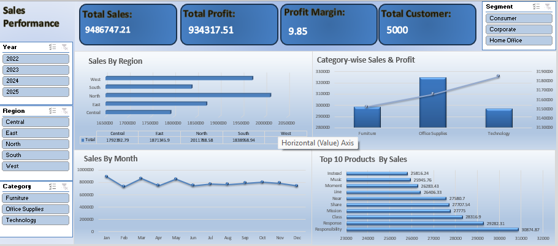
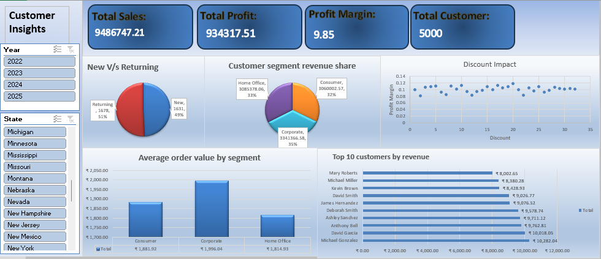
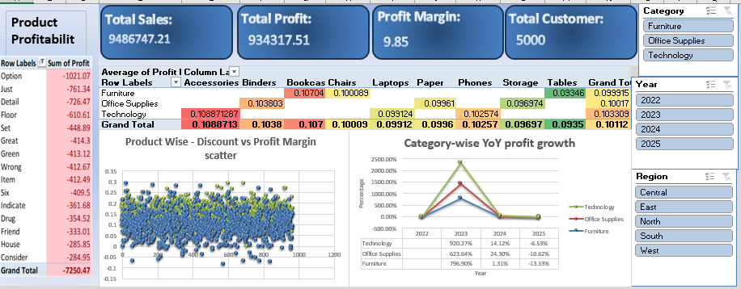

# 📊 Sales Performance Dashboard

## 📌 Overview
This project presents a **Sales Performance Dashboard** created using Excel.  
It focuses on analyzing sales data to provide insights into regional performance, product categories, and overall business trends.

The dashboard is designed to simplify data interpretation and support better decision-making.

---

## 🎯 Key Features
- Interactive dashboard using slicers  
- Sales analysis by region  
- Category-wise sales and profit insights  
- Monthly sales trend visualization  
- Top-performing products identification  

---

## 📷 Dashboard Preview

### 🔹 Dashboard View 1

### 🔹 Dashboard View 2

### 🔹 Dashboard View 3

---

## 🛠️ Tools Used
- Microsoft Excel  
- Data Analysis  
- Data Visualization  

---

## 🚀 How to Use
1. Download the Excel file  
2. Open it in Microsoft Excel  
3. Use slicers and filters to explore insights  

---

## 🔗 GitHub Repository
https://github.com/om-patel-83/Global_Sales_retail_Dashboard

---

## 🙌 Conclusion
This project demonstrates how Excel can be used to create interactive dashboards and derive meaningful insights from data.
